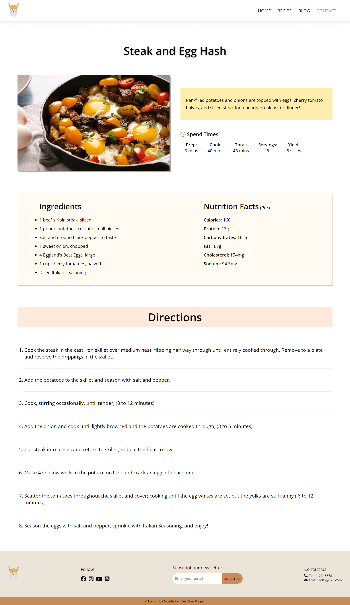

# OdinRecipes

### About

It's a simple recipe page. Click the recipe link to show more information about the dishes.

### Project preview

---

### Tech

 

### Thought

This assignment is from the Odin Project Fundamentals course. I did this using HTML and CSS skills and figuring out how to add and push projects in GitHub. Most importantly, it was great to discover that what I had learned could be presented successfully.

### Plan for updates

- RWD
