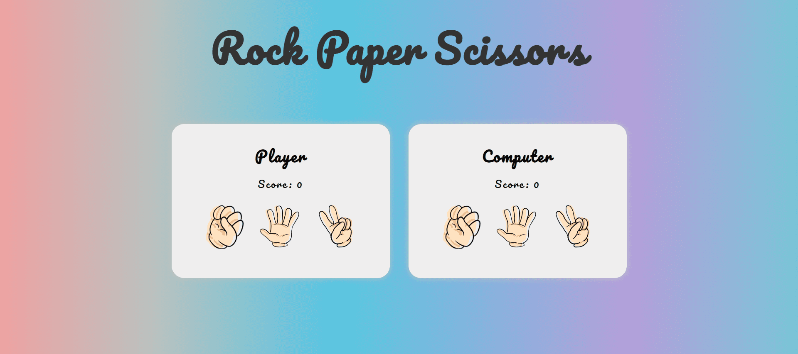

# Rock Paper Scissors

## About

It's a small game about rock paper scissors.You can restart the game after five rounds.

## Project preview

--- 

## Tech

 

## Thought

The first assignment includes JavaScript in The Odin Project. It is a pleasure to make a small game. Increase RWD so that mobile devices can also play games.
